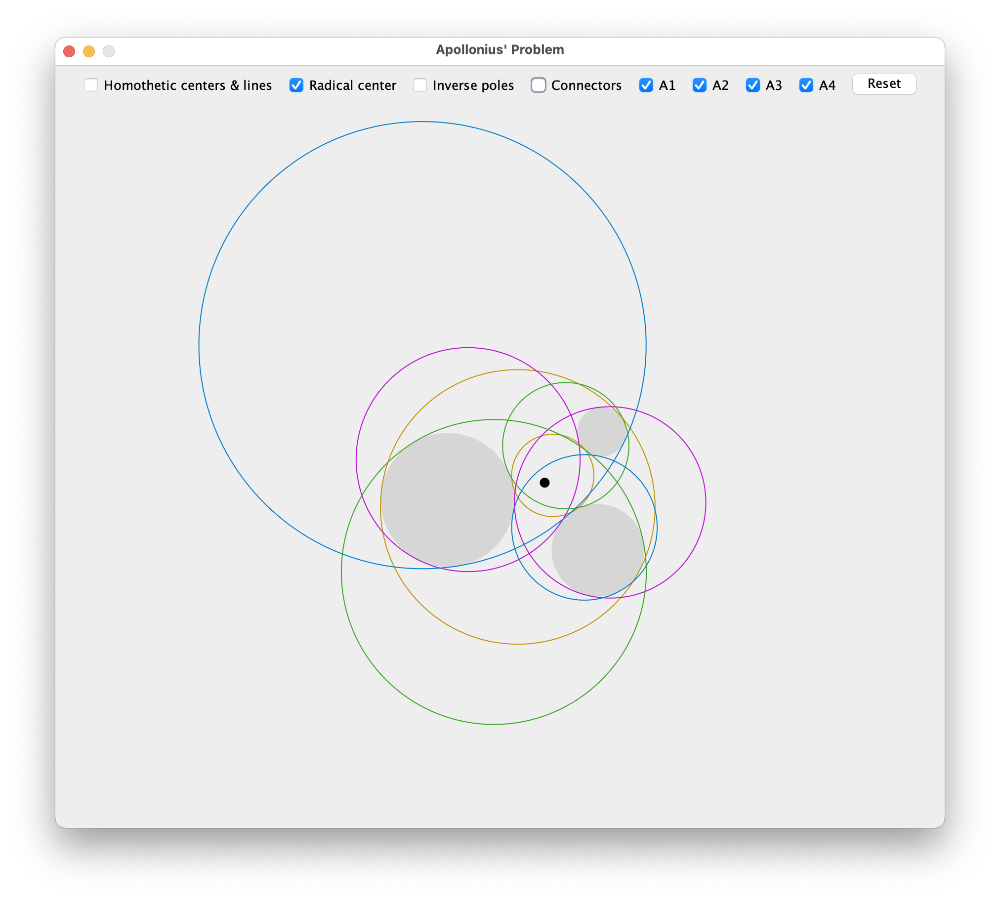

# Apollonius' Problem
A short demo on an ancient problem about finding possible circles that are tangent to any 3 given starting circles, written in Java.

Features:
- Drag and scale the 3 starting circles (with mouse and mouse wheel respectively)
- Show/hide other properties used to construct the resultant circles

Issues:
- [ ] Homothetic lines straight up breaks when changing the size order
- [ ] During moving a circle, cursor might transfer to another circle if the cursor gets close enough B's center
- [ ] Very quick cursor movement can skip the circle dragging 
- [ ] In some cases, an Apollonius circle ends up inside the starting circles

Credits to [Wolfram](https://mathworld.wolfram.com/ApolloniusProblem.html) for the steps needed to write this.
